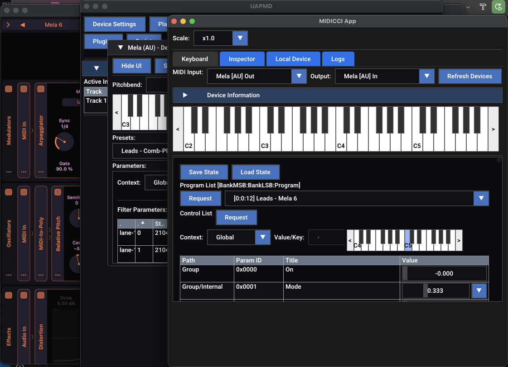

## midicci: MIDI-CI tools and libraries in C++, and a fully featured software MIDI 2.0 keyboard



**midicci** is a MIDI-CI tools and libraries in C++. It comes with a fully featured MIDI 2.0 keyboar application that supports various standard MIDI-CI properties.

@atsushieno does not know any other MIDI-CI product that actually achieves the MIDI 2.0 functionality at this level, as either software or hardware. (KORG MIDI 2.0 products can interact with each other in their non-standard parameter list dialect.)

### Supported MIDI 2.0 Features

`(lib)midicci` and `midicci-app` support the following features:

- UMP outputs
- MIDI-CI standard properties: `AllCtrlList`, `ProgramList`, `State` (with `fullState` resId)
- and any foundational technology behind those (such as basic MIDI-CI messaging)

## Build, Install, and Use midicci

### Binary Packages

Binary packages are available in the [Releases](https://github.com/atsushieno/midicci/releases) page:

- **Linux**: DEB, RPM, and TXZ packages
- **macOS**: DMG (drag-and-drop app bundle) and ZIP archives
- **Windows**: ZIP archives (with optional NSIS installer when available)

For macOS there is also a Homebrew setup available: `brew install atsushieno/oss/midicci`

### Building from Source

Use CMake to build from source:

```
cmake -B build -G Ninja
cmake --build build
cmake --install build --prefix /usr/local
```

To create distribution packages locally:

```
cmake --build build --target package
```

Windows builds support the [Windows MIDI Services](https://github.com/microsoft/MIDI) backend through libremidi. The required NuGet package (`Microsoft.Windows.Devices.Midi2.1.0.14-rc.1.209.nupkg`) is included in the `external/` directory. Windows MIDI Services integration is enabled by default on Windows (controlled by `MIDICCI_ENABLE_WINMIDI` option).

For Windows GUI builds we try to use SDL3 via a prebuilt package. During configuration CMake downloads vcpkg (or reuses an existing `VCPKG_ROOT`), installs the static `sdl3` package for the active triplet, and exposes it through `find_package(SDL3)`. If SDL3 cannot be prepared automatically the build falls back to SDL2 or GLFW as before. You can override the download behavior with `MIDICCI_VCPKG_URL`, `MIDICCI_VCPKG_URL_HASH`, or `MIDICCI_VCPKG_TRIPLET` when pointing to a different mirror or architecture.

### Using midicci

midicci comes with `midicci-app`, a MIDI 2.0 keyboard and MIDI-CI diagnostic tool (unified).

If you launch `midicci-app`, the first thing you should do is to select the MIDI In port and the MIDI Out port to use (unlike MIDI 1.0 software keyboard, MIDI 2.0 is interactive and you have to choose both in and out).

`midicci-app` checks if the in and out port namess share the same name except for `In` and `Out` suffix, and if they match, then it automatically starts MIDI-CI connection process from Discovery to individual MIDI-CI property retrieval (`AllCtrlList`, `ProgramList`, and subsequent `CtrlMapList` properties). If the names do not match, you'll have to manually "Send Discovery" to do get it really functional.

If your device does not support MIDI-CI, it still works just as a UMP keyboard, but that's not very exciting (@atsushieno does not know any other MIDI 2.0 UMP keyboard app either, but even an AI coding agent can hack one in a few interactions if you use libremidi or alike).

## Technical Notes

### Almost no dependency

`midicci-app` is just a MIDI 2.0 keyboard. While I (@atsushieno) demonstrate a lot with [uapmd](https://github.com/atsushieno/uapmd) which is basically an audio plugin host that exposes those plugin instances as virtual MIDI 2.0 devices, `midicci-app` itself is NOT an audio plugin client.

It does not depend on any premise UAPMD presumes either. No matter how UAPMD maps plugin parameters to MIDI controllers (CC, Registered Controllers aka RPNs, Assignable Controllers aka NRPNs, per-note controllers), they will be shown on the parameter list as long as they are included in `AllCtrlList` property.

This client app demonstrates how MIDI 2.0 is capable of various features that traditionally only audio plugins, where no "Standard" exists, have achieved.

while `midicci-app` makes full use of platform UMP (MIDI 2.0) device access API using [celtera/libremidi](https://github.com/celtera/libremidi), `(lib)midicci` as a library does not depend on any platform MIDI access. The message interactions are designed to be transport agnostic. Any bidirectional messaging system (they can be even pair of function lambdas), `(lib)midicci` just works.

### The Origin

It started as an agentic coding experiment to port [ktmidi-ci](https://github.com/atsushieno/ktmidi/tree/main/ktmidi-ci) and [ktmidi-ci-tool](https://github.com/atsushieno/ktmidi/tree/main/ktmidi-ci-tool) to C++ so that I (@atsushieno) can build a **fully featured** MICI-CI library based on the existing implementation **under a liberal license**.

It was fairly successful. It is mostly working fine, sometimes ahead of ktmidi-ci. It is the MIDI-CI integration engine in my [uapmd](https://github.com/atsushieno/uapmd) project, and the GUI application (based on ImGui) can communicate with ktmidi-ci-tool or [MIDI2.0Workbench](https://github.com/midi2-dev/MIDI2.0Workbench) at a fairly good level.

## License and dependencies

midicci is released under the MIT license.

We use [celtera/libremidi](https://github.com/celtera/libremidi) for MIDI device access, which is released under the BSD license (its dependencies are under the MIT license and the BSD license).

We use [ocornut/imgui](https://github.com/ocornut/imgui) for the GUI.

We use [zlib-ng/zlib-ng](https://github.com/zlib-ng/zlib-ng) for Mcoded7 compression (also fits nicely in Windows build), which is released under the Zlib license.

We use [Roboto font](https://fonts.google.com/specimen/Roboto) which is released under the SIL Open Font License v1.1. (we bundle `Roboto-SemiBold.ttf`)

## Development

It started as an agentic coding experiment, although we have been making changes a lot of later on. Code quality is as low as generated. While we welcome contributions, please do not expect any "contributable" state there.

Initially I used Devin to instruct it to generate code, but now I switched to Claude Code and Codex to fix a lot of mistakes by Devin and each other, and I fix various issues by myself.
