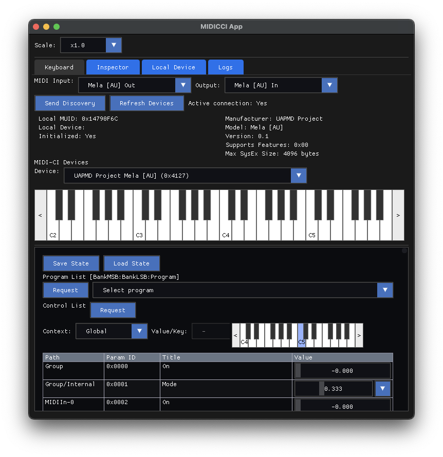

## midicci: MIDI-CI tools and library in C++



It is an agentic coding experiment to port [ktmidi-ci](https://github.com/atsushieno/ktmidi/tree/main/ktmidi-ci) and [ktmidi-ci-tool](https://github.com/atsushieno/ktmidi/tree/main/ktmidi-ci-tool) to C++ so that I can build a **fully featured** MICI-CI library based on the existing implementation **under a liberal license**.

So far it is fairly successful. It is mostly working, sometimes ahead of ktmidi-ci It is the MIDI-CI integration engine in my [uapmd](https://github.com/atsushieno/uapmd) project, and the GUI application (based on ImGui) can communicate with ktmidi-ci-tool or [MIDI2.0Workbench](https://github.com/midi2-dev/MIDI2.0Workbench) to some extent.

## Build, Install, and Use midicci

### Binary Packages

Binary packages are available in the [Releases](https://github.com/atsushieno/midicci/releases) page:

- **Linux**: DEB, RPM, and TXZ packages
- **macOS**: DMG (drag-and-drop app bundle) and ZIP archives
- **Windows**: ZIP archives (with optional NSIS installer when available)

For macOS there is also a Homebrew setup available: `brew install atsushieno/oss/midicci`

### Building from Source

Use CMake to build from source:

```
cmake -B build -G Ninja
cmake --build build
cmake --install build --prefix /usr/local
```

To create distribution packages locally:

```
cmake --build build --target package
```

#### Windows MIDI Services Support

Windows builds support the [Windows MIDI Services](https://github.com/microsoft/MIDI) backend through libremidi. The required NuGet package (`Microsoft.Windows.Devices.Midi2.1.0.14-rc.1.209.nupkg`) is included in the `external/` directory. Windows MIDI Services integration is enabled by default on Windows (controlled by `MIDICCI_ENABLE_WINMIDI` option).

### Using midicci

midicci comes with a MIDI 2.0 keyboard and MIDI-CI diagnostic utility `midicci-app`.

## License and dependencies

midicci is released under the MIT license.

We use [libremidi](https://github.com/celtera/libremidi) for MIDI device access, which is released under the BSD license (its dependencies are under the MIT license and the BSD license).

We use ImGui for the GUI, after various attempts to let Devin and Claude Code to write React+Electron code as well as Flutter code. Devin generated platform channels while it should be dart FFI. Claude did not make such a mistake, but could not handle complicated interop scenarios especially beyond isolates. I didn't feel I should try similar for React with its threading model. But you should take these with 
a grain of salt because the situation around agentic coding is a moving target.

We use [zlib-ng](https://github.com/zlib-ng/zlib-ng) for Mcoded7 compression (also fits nicely in Windows build), which is released under the Zlib license.

We use [Roboto font](https://fonts.google.com/specimen/Roboto) which is released under the SIL Open Font License v1.1. (we bundle `Roboto-SemiBold.ttf`)

## Development

It is not much more than an agentic coding experiment. Code quality is as low as generated. But also I make changes by myself too to avoid silly requests to them.

Initially I used Devin to instruct it to generate code, but now I switched to Claude Code and Codex to fix a lot of mistakes by Devin and each other, and I fix various issues by myself.
